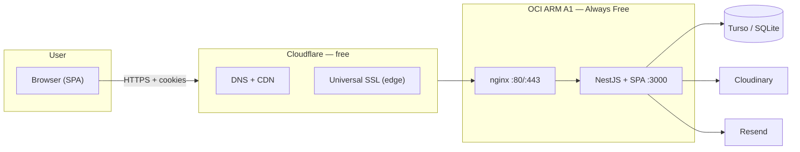
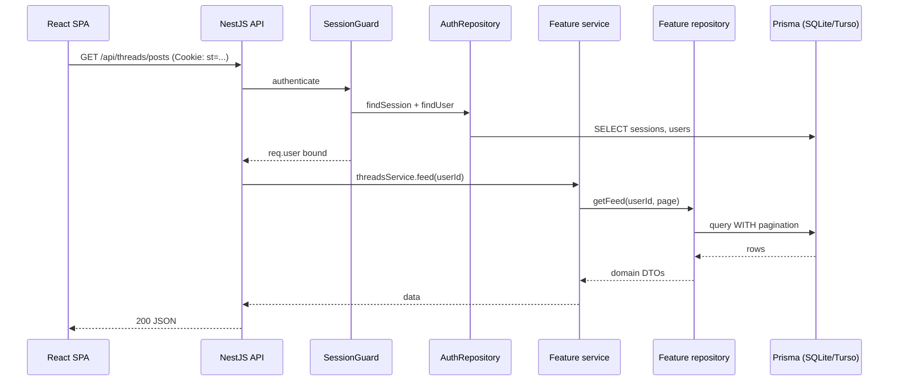
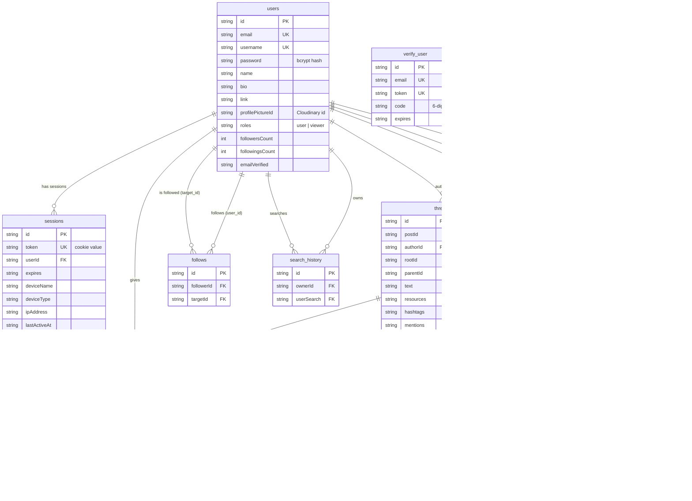

<div align="center">

# Threads Clone

A full-stack Threads (Meta) clone — text-first posting, replies, mentions, likes, follows, profiles, search, and a real-time activity feed. Built as a **modular monolith** and deployed on Oracle Cloud's free tier.

[Live demo](https://threads-clone.henrry.site)

**NestJS · React · TypeScript · Prisma · Turso/SQLite · Docker · Cloudflare · OCI**

</div>

---

## Table of contents

- [Project purpose](#project-purpose)
- [Architecture](#architecture-modular-monolith)
- [System diagram](#system-diagram)
- [Repository Pattern](#repository-pattern)
- [Authentication & Sessions](#authentication-sessions)
- [Frontend](#frontend-react-tanstack-router-query-zustand)
- [Data model](#data-model-11-tables)

## Project purpose

I wanted to build something that felt like a real product, not a tutorial app. That meant:

- Auth that feels production-grade (HttpOnly cookies, device-scoped sessions, email verification, password reset).
- A feed that handles infinite scroll, optimistic updates, and nested reply chains.
- Notifications that actually work (replies, mentions, likes, follows).
- A deployment that doesn't cost money but still has real TLS, a CDN, and DDoS protection.

---

## Architecture: Modular monolith

One Docker image. One Node process. One database. But inside, the NestJS app is split into feature modules that talk through Dependency Injection.

```
src/
├── auth/           # signup, login, sessions, guards, verification, reset
├── account/        # profile CRUD, follow system, activity feed
├── threads/        # feed, create/delete threads & replies, search
│   └── likes/      # like/unlike (own module, nested)
├── saved/          # bookmarks
├── search/         # user search + history
├── users/          # public profiles + test accounts
├── prisma/         # @Global PrismaService (SQLite local, Turso remote)
├── mail/           # @Global Resend email
└── common/         # cookie, password, device, Cloudinary helpers
```

Each feature owns its controllers, services, DTOs, and **abstract repository + Prisma implementation**. Only repositories touch Prisma. Guards live in `auth` and get reused by importing `AuthModule`. The `AccountModule` exports `ActivityService` so `Threads` and `Likes` can write notifications — synchronous, in-process. No message bus, no Redis, no microservices. That coupling is a deliberate trade-off (see below).

### Modular monolith over microservices

**Decision:** Maintain everything within a single deployable unit, with feature-module boundaries.

**Reasoning:** At this product’s scale, microservices introduce network failure modes, operational complexity, and a message broker that offers no user-visible benefits. The modular structure ensures that teams and features remain decoupled and preserves the option to extract services later (the repository seams are already in place).

**Trade-off:** A shared database and synchronous cross-feature calls (e.g., threads → activity) are required. If notification throughput ever becomes a bottleneck, the solution is an asynchronous boundary (queue/event), which is a well-understood, one-zone change.

---

## System diagram



### Flow:

- The browser loads the static SPA (served by the NestJS app) and calls the REST API under `/api`.
- Cloudflare manage the DNS and SSL/TLS.
- OCI Instance runs two Docker images with Docker Compose. One is Nginx that contains the origin SSL/TLS Cloudflare Certificate, and the other image runs the Node.js process that handles the HTTP, rate limiting, validation, business logic and persistence.
- Images and email are delegated to managed services (Cloudinary and Resend).

### Why Nginx + Cloudflare on a single ARM instance

**Reasoning:** While it’s important to stay on a free plan, production-level deployments, such as those involving real CDN and TLS, can be achieved without relying on a cloud vendor. This means that the same image can be deployed on any VPS, such as AWS.

**Trade-off:** However, a single VM represents a single point of failure. This can be acceptable for a portfolio-grade production deployment.

---

## Repository Pattern

Every feature defines an abstract repository interface. The Prisma implementation lives in `prisma.*.repository.ts` and gets wired via `{ provide, useClass }`.

```ts
// threads.repository.ts — contract (domain types only, no Prisma types leak)
export abstract class ThreadsRepository {
  abstract findById(id: string): Promise<Thread | null>;
  abstract createThread(data: CreateThreadData): Promise<Thread>;
  // ...
}

// prisma.threads.repository.ts — implementation
@Injectable()
export class PrismaThreadsRepository extends ThreadsRepository {
  constructor(private readonly prisma: PrismaService) {}
  // Prisma code lives here — and only here
}

// threads.module.ts — wiring
@Module({
  providers: [
    ThreadsService,
    { provide: ThreadsRepository, useClass: PrismaThreadsRepository },
  ],
})
export class ThreadsModule {}
```

Benefits:

- **Testability** — services can be unit-tested against a mocked repository without touching a database.
- **Transport / DB portability** — the same schema runs on local SQLite and remote Turso by swapping Prisma driver adapters at runtime.
- **SOLID** — single responsibility, dependency inversion (business logic depends on abstractions).

### Repository pattern as the persistence seam

**Reasoning:** Tests can mock repositories in memory. The schema can support both **SQLite (development)** and **Turso (production)** without any changes to the service. This enforces the rule that “repositories are the only Prisma users,” which helps maintain a clean domain layer.

**Trade-off:** There’s an additional file per repository and occasional mapper boilerplate, but these are worth it for the improved testability and portability.

---

## Authentication & Sessions

Auth is **cookie-based**, not JWT, so sessions are server-owned, revocable, and device-visible.

```
SPA ──calls──▶ API ──binds──▶ SessionGuard ──reads HttpOnly cookie "st"──▶ AuthRepository ──▶ Prisma
                                                                                  │
                                    ┌──────────────────────────────────────┴───────────────┐
                                    ▼                                                      ▼
                              sessions (1 year)                                      users
```

- **Session cookie** `st`: HttpOnly, 1-year expiry, `secure` in production, `COOKIE_DOMAIN`-aware.
- **Two guards**: `GetUserGuard` (optional session → 204) and `SessionGuard` (required session → 401 on missing/invalid token).
- **Device tracking**: `ua-parser-js` records device name/type/IP/user-agent per session for the Sessions UI.
- **Brute-force protection**: per-route rate limits (below) applied before any password work.

### HttpOnly session cookie over JWT

**Reasoning:** Sessions are instantly **revocable** (delete a session → user logs out), per-device (the Sessions UI lists device/IP/UA), and immune to XSS token theft (HttpOnly). JWT, on the other hand, places revocation and logout-where-you-want behind extra infrastructure (denylists).

**Trade-off:** Stateful sessions require a DB read per request (which is cheap here), and horizontal scaling requires shared session storage — which is irrelevant at this scale and makes the architecture modular-monolith-friendly.

### Authenticated request lifecycle (applied to any protected route)



### Rate limiting policy

| Endpoint / scope   | Limit       |
| ------------------ | ----------- |
| Global default     | 100 req/min |
| Login              | 10 / 5 min  |
| Sign-up            | 5 / 10 min  |
| Email verification | 3 / 5 min   |
| Password reset     | 3 / 10 min  |
| Account updates    | 10 / 15 min |

---

## Frontend: React + TanStack Router + Query + Zustand

| Layer        | Tool                  | What it owns                                                 |
| ------------ | --------------------- | ------------------------------------------------------------ |
| Routing      | TanStack Router       | File-based, lazy routes, `beforeLoad` auth gates             |
| Server state | TanStack Query        | Caching, invalidation, infinite scroll, optimistic mutations |
| Client state | Zustand               | Composer drafts, modal/backdrop (ephemeral only)             |
| Forms        | react-hook-form + Zod | Client-side validation mirrors server DTOs                   |

Auth is cookie-only: `credentials: "include"` on every fetch. No tokens in localStorage. The SPA is served statically by NestJS via `ServeStaticModule` (excludes `/api/*`).

### Frontend state split: TanStack Query vs. Zustand

**Decision:** All server-derived state resides in TanStack Query and Zustand only manages a small portion of the UI state, including composer drafts, modal open flags, and backdrop.

**Reasoning:** The majority of the application state is stored on the server. TanStack Query is a comprehensive tool designed to manage caching, invalidation, and retry mechanisms. It is specifically built to handle asynchronous data. The remaining parts of the application that require managing small state components are layered by Zustand. By keeping the client state minimal, we ensure predictability and avoid conflicts with multiple caches.

---

## Data model (11 tables)

Threads model **both** posts and replies (`parentId` null = root; replies hang off `rootId`/`parentId`). Denormalized counters (`likesCount`, `repliesCount`, `followersCount`) updated atomically in Prisma transactions.



---

## Testing strategy

| Layer   | Tool                 | Status                              |
| ------- | -------------------- | ----------------------------------- |
| Unit    | Jest                 | Services vs mocked repos            |
| API E2E | Jest + supertest     | HTTP contracts, guards, rate limits |
| UI E2E  | Playwright           | Login + home feed journey           |

Unit and API E2E run against a throwaway SQLite file (`file:./test.e2e.db`); the Playwright suite boots the real stack (NestJS + Vite + SQLite).

**Combined coverage** (unit + e2e · `test:cov:all`): **72% stmts · 65% branches · 57% funcs · 71% lines** — thresholds enforced in CI (60/50/50/60).

```bash
# Backend (from ./server)
npm run test          # unit tests (152)
npm run test:e2e      # API e2e with supertest (32)
npm run test:cov:all  # combined coverage, enforces thresholds

# UI e2e (from ./e2e) — boots NestJS + Vite, then runs Playwright
npm run test          # playwright test (chromium)
npx playwright install chromium   # first time only
```

CI runs all of the above on every push/PR: `server` tests + coverage, `frontend` lint + build, and the Playwright full-stack suite.

---

## Extra Key Decisions

- **Synchronous ActivityService calls** from `ThreadsService`/`LikesService` → `AccountModule`. It works now, but it couples features. If notification volume grows, I'd extract to an event bus (or at least a BullMQ queue) so threads don't block on notification writes.
- **Base64 image uploads** with a 50MB body limit. Simpler than multipart, but synchronous Cloudinary uploads inside the request. A streaming upload endpoint would be cleaner.
- **Email sends are inline** with manual cooldown timestamps. No queue, no retries. If a burst of password resets hits, they send synchronously. Documented upgrade path: BullMQ + dead-letter queue.
- **Atomic counters via transactions.** In `likesCount`, `repliesCount`, and `followersCount` are denormalized, mutated inside a prisma transaction. This way reads stay fast, no `COUNT(*)` and counters never rollback on failure mid-counter. The trade-off is a write cost per mutation, but correct under concurrency.
- **Global shared modules vs feature-owned providers.** `PrismaModule` and `MailModule` are `@Global` services (cookie, password, device, Cloudinary) are re-registered per consuming module rather than globalized. Prisma/Mail are single instances used everywhere. The common helpers are explicit about their consumers, avoiding hidden global dependencies.

---

## Running locally

```bash
# Backend
cd server
bun install         # or npm install
bun run start:dev   # or npm run start:dev

# Frontend
cd frontend
bun install
bun run dev          # proxies /api → localhost:3000
```

**Env vars needed:**

```
# ./server/.env file

DATABASE_URL=file:./dev.db
DATABASE_AUTH_TOKEN=''

RESEND_API_KEY=''

NODE_ENV=developement

CLOUDINARY_CLOUD_NAME=''
CLOUDINARY_API_KEY=''
CLOUDINARY_API_SECRET=''

COOKIE_DOMAIN=localhost
SITE_URL=http://localhost:5173
PORT=3000
```

---

## Contact

<span>

[LinkedIn](https://www.linkedin.com/in/henrry-beltran-de-la-torre/)
[Portfolio](https://henrry.site)

</span>
